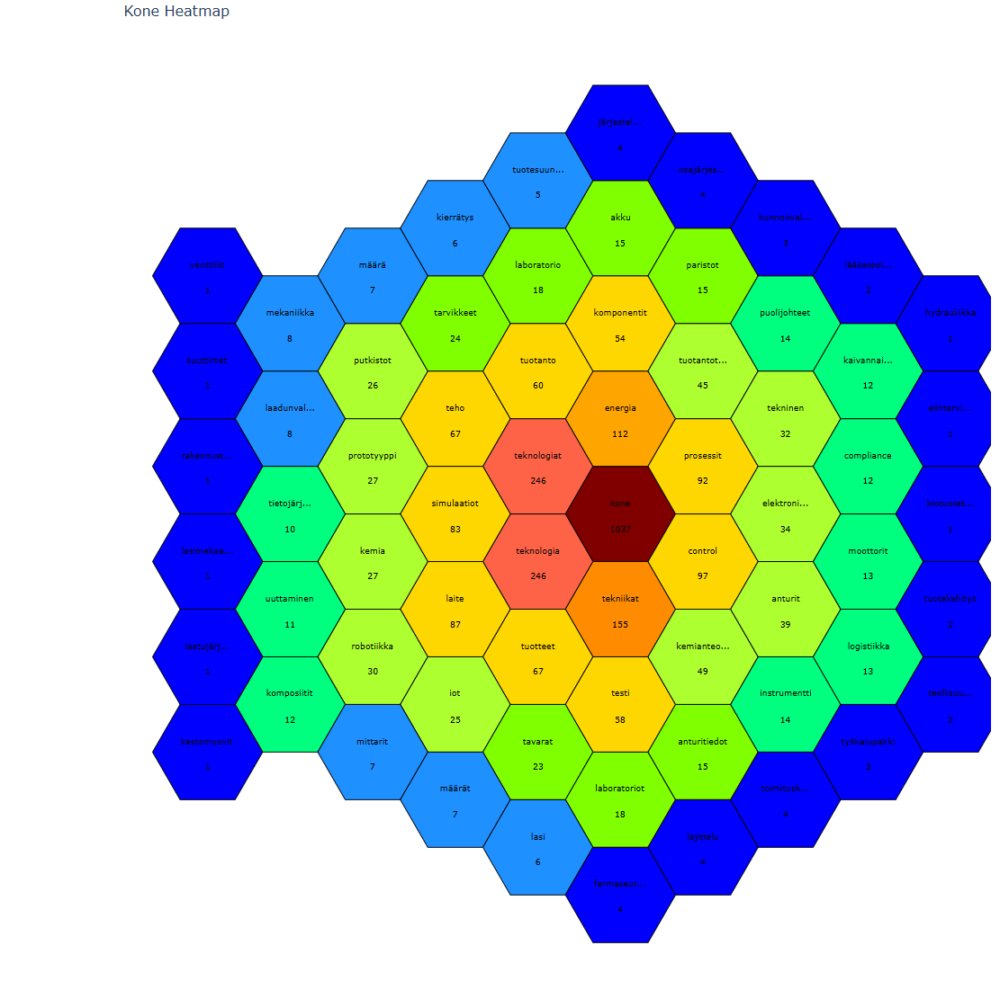
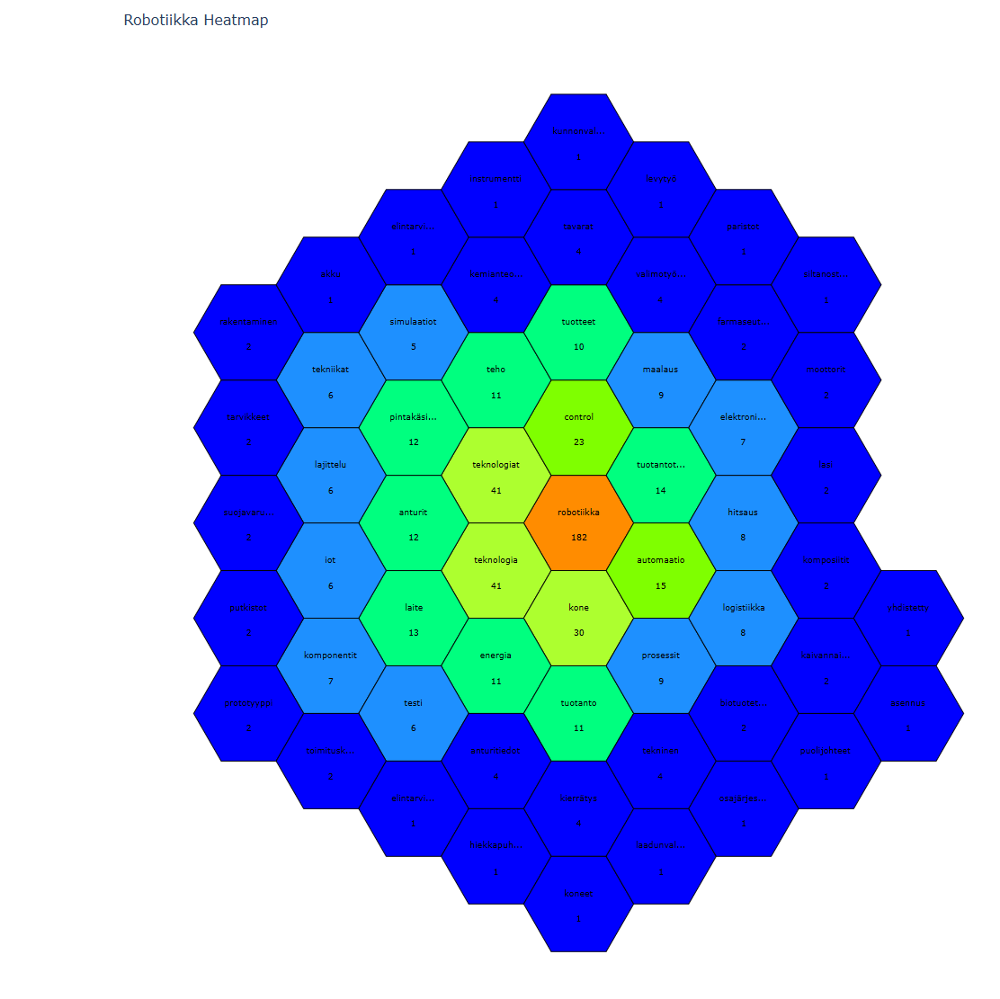
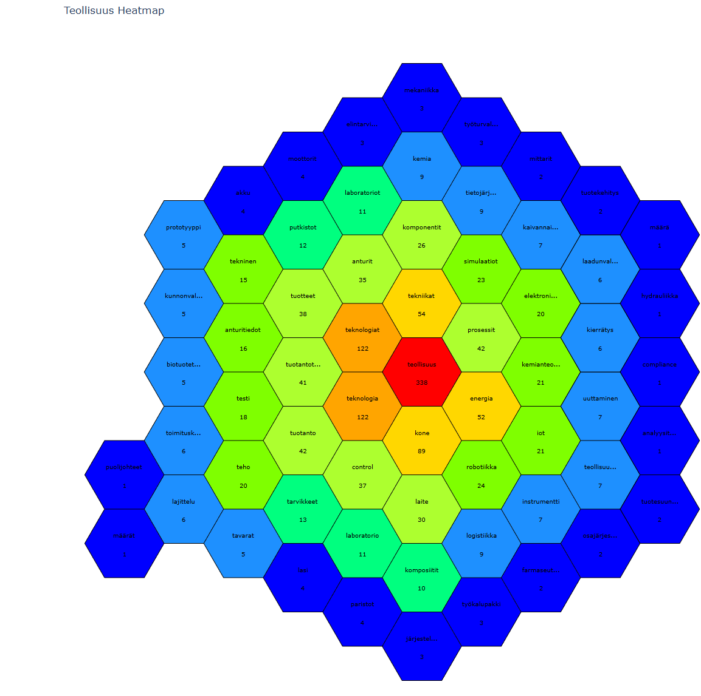
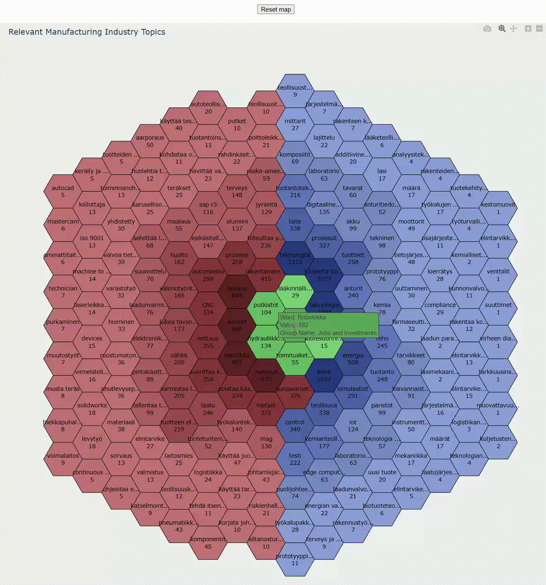

# Manufacturing Industry Data Analysis

**Note: This is a data visualization project analyzing manufacturing industry trends. The original dataset is proprietary, so this repository is a slightly modified copy of original, containing only the processing pipeline and anonymized/aggregated outputs.**

## 📊 Preview


**Kone Heatmap**

**Robotiikka Heatmap**

**Teollisuus Heatmap**

**Manufacturing Industry Topics Heatmap**

## 🎯 About

A data analysis project visualizing which topics are relevant in the Finnish manufacturing industry. The project processes raw data through clustering, AI-powered label scoring, and generates interactive heatmap visualizations.

### Key Features

- **Data Clustering** - Groups similar terms and concepts together
- **AI Label Scoring** - Uses Gemini AI to score relevance to manufacturing
- **Interactive Heatmaps** - Jupyter notebooks with visual correlation analysis

## 📁 Project Structure

```
src/
├── clustering/        # Cluster similar data points
├── label-scoring/     # AI-powered relevance scoring (Gemini)
├── raw-data/          # Data fetching and extraction scripts
├── sorting/           # Heatmap sorting utilities
├── visual/            # Jupyter notebooks with heatmap visualizations
└── visualization-data/# Data preparation for final visualizations
```

## 🚀 Quick Start

### Prerequisites

- Python 3.x ([python.org](https://python.org))

### Installation

```bash
# Clone the repository
git clone https://github.com/simoalanne/manufacturing-industry-data-analysis

cd manufacturing-industry-data-analysis/src

# Create and activate virtual environment
python -m venv venv

# Windows
venv\Scripts\activate

# macOS/Linux
source venv/bin/activate

# Install dependencies
pip install -r requirements.txt
```

### Run Visualizations

```bash
jupyter notebook
```

Navigate to `src/visual/` and open any notebook. Run all cells to generate the heatmaps.

## 🛠️ Tech Stack

- **Python** - Core processing scripts
- **Jupyter Notebook** - Interactive visualizations
- **Google Gemini AI** - Label relevance scoring
- **Plotly/Dash** - Heatmap generation
